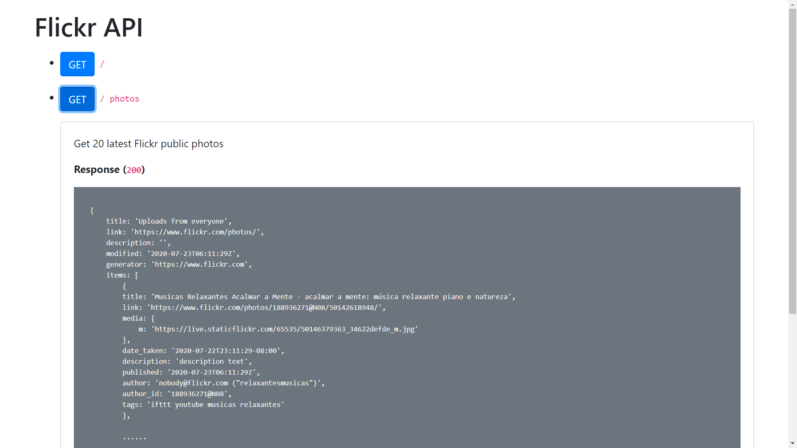

# React, Express & Flickr API

### 📁 Backend Overview

- __Tools__

    - ```"cors": "^2.8.5"```
    - ```"dotenv": "^8.2.0"```
    - ```"express": "^4.17.1"```
    - ```"flickr-sdk": "^3.9.0"```

- __Result__

    - ```GET /``` 
    
        Show a simple homepage (API docs)

        

    <hr>

    - ```GET /photos```
        
        Get 20 latest Flickr public photos in JSON

        ```json
        {
            title: 'Uploads from everyone',
            link: 'https://www.flickr.com/photos/',
            description: '',
            modified: '2020-07-23T06:11:29Z',
            generator: 'https://www.flickr.com',
            items: [
                {
                title: 'Musicas Relaxantes Acalmar a Mente - acalmar a mente: música relaxante piano e natureza',
                link: 'https://www.flickr.com/photos/188936271@N08/50142618948/',
                media: {
                    m: 'https://live.staticflickr.com/65535/50146379363_34622defde_m.jpg'
                },
                date_taken: '2020-07-22T23:11:29-08:00',
                description: 'description text',
                published: '2020-07-23T06:11:29Z',
                author: 'nobody@flickr.com ("relaxantesmusicas")',
                author_id: '188936271@N08',
                tags: 'ifttt youtube musicas relaxantes'
                },
                
                ......

            ]
        }   
        ```

    <hr>

    - ```GET /fave```

        Get all your favorite photos

        ```json
        [    
            {
                "title": "20180804_会津駒ヶ岳_0438.jpg",
                "author": "veryblue123",
                "description": "Description text",
                "published": "2020-07-26",
                "tags": "",
                "image": "https://live.staticflickr.com/65535/50153804946_70ef5b8d0f_m.jpg"
            },
            
            ......

        ]
        ```

    <hr>

    - ```POST /fave```

        Add your favorite photos

        - ```Headers```

            ```json
            {
                'Content-Type': 'application/json;charset=utf-8'
            }
            ```
        
        - ```Body request```

            ```json
            {
                title: ... ,
                author: ... ,
                description: ... ,
                published: ... ,
                tags: ... ,
                image: ... ,
            }
            ```

        - ```Response```

            ```json
            {
                "title": "20180804_会津駒ヶ岳_0438.jpg",
                "author": "veryblue123",
                "description": "Description text",
                "published": "2020-07-26",
                "tags": "",
                "image": "https://live.staticflickr.com/65535/50153804946_70ef5b8d0f_m.jpg"
            }
            ```

    <hr>
    
    - ```DELETE /fave/{index}```

        Delete a favorite photo

        - ```Headers```

            ```json
            {
                'Content-Type': 'application/json;charset=utf-8'
            }
            ```

        - ```Response```

            ```json
            {
                "status": "Data {index} deleted"
            }
            ```

<hr>

#### Lintang Wisesa :love_letter: _lintangwisesa@ymail.com_

[Facebook](https://www.facebook.com/lintangbagus) | 
[Twitter](https://twitter.com/Lintang_Wisesa) |
[LinkedIn](https://www.linkedin.com/in/lintangwisesa/) |
[Youtube](https://www.youtube.com/user/lintangbagus) | 
:octocat: [GitHub](https://github.com/LintangWisesa) |
[Hackster](https://www.hackster.io/lintangwisesa)